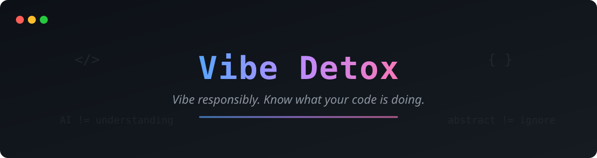
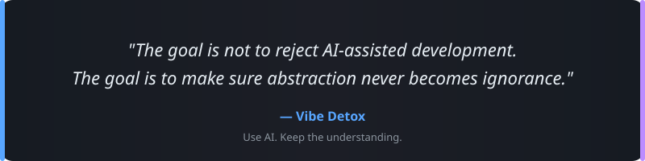
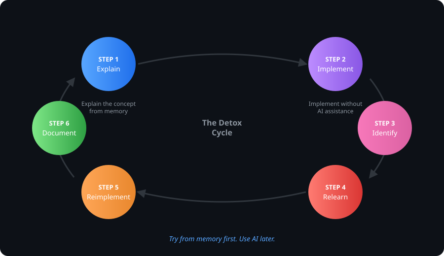
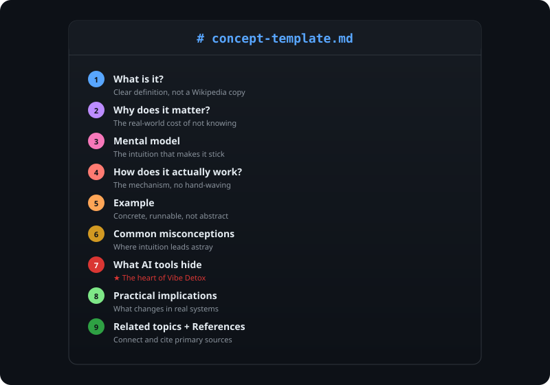
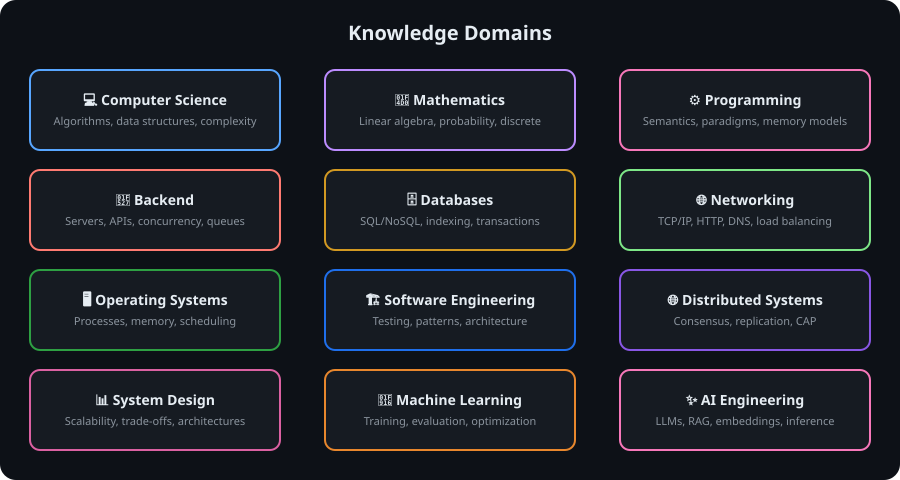

<p align="center">
  
</p>

<p align="center">
  <a href="LICENSE"></a>
  <a href="CONTRIBUTING.md"></a>
  <a href="CODE_OF_CONDUCT.md"></a>
  
</p>

<p align="center"><em>Vibe responsibly. Know what your code is doing.</em></p>

---

Vibe Detox is a community-driven project for rebuilding and preserving the fundamentals behind modern software development.

AI can generate code faster than ever, but understanding still matters.

This repository collects clear, practical explanations of the concepts that developers increasingly rely on without thinking about — from algorithms, networking, databases, and operating systems to machine learning and AI engineering.

The goal is not to reject AI-assisted development.

**The goal is to make sure abstraction never becomes ignorance.**

<p align="center">
  
</p>

---

## The Detox Cycle

> **Try from memory first. Use AI later.**

<p align="center">
  
</p>

The process:

1. **Explain** the concept from memory.
2. **Implement** it without AI assistance.
3. **Identify** what you forgot or misunderstood.
4. **Relearn** the underlying theory.
5. **Reimplement** it cleanly.
6. **Document** the lessons learned.

---

## The Standard

Not a tutorial dump. A knowledge base with a single, consistent format.

Every entry follows the same structure — so the knowledge base stays consistent no matter who writes it.

<p align="center">
  
</p>

Every entry answers:

1. **What is it?** — Clear definition, not a Wikipedia copy
2. **Why does it matter?** — The real-world cost of not knowing
3. **Mental model** — The intuition that makes it stick
4. **How does it actually work?** — The mechanism, no hand-waving
5. **Example** — Concrete, runnable, not abstract
6. **Common misconceptions** — Where intuition leads astray
7. **What abstractions / AI tools often hide** — ★ The heart of Vibe Detox
8. **Practical engineering implications** — What changes in real systems
9. **Related topics** — Connect to other concepts
10. **References** — Cite primary sources

---

## Knowledge Domains

<p align="center">
  
</p>

---

## Ways to Contribute

| | Way | How |
|---|---|---|
| 📝 | **Add a missing fundamental concept** | Pick something developers use without understanding, explain it clearly using the [template](templates/concept-template.md). |
| ✏️ | **Improve an existing explanation** | Make it clearer, more accurate, or more practical. |
| 📊 | **Add diagrams or examples** | A good example is worth a thousand words. |
| 🔧 | **Correct technical inaccuracies** | Precision matters — open an issue with `correction` label. |
| 📚 | **Add references** | Link to papers, books, talks, RFCs. |
| 💡 | **Suggest topics developers are forgetting** | Open an issue with the `forgotten-fundamental` label. |

See [`CONTRIBUTING.md`](CONTRIBUTING.md) to get started.

### Forgotten Fundamentals

We use a special label — `forgotten-fundamental` — for topics developers increasingly rely on without understanding:

> `forgotten-fundamental: TCP congestion control`
> `forgotten-fundamental: database isolation levels`
> `forgotten-fundamental: Python GIL`
> `forgotten-fundamental: backpropagation`
> `forgotten-fundamental: virtual memory`

See something missing? [Open an issue](https://github.com/timcanby/vibe-detox/issues/new?labels=forgotten-fundamental) and tag it.

---

## Repository Structure

```
vibe-detox/
├── README.md
├── CONTRIBUTING.md
├── CODE_OF_CONDUCT.md
├── ROADMAP.md
├── LICENSE
│
├── assets/                       # Diagrams and images
│
├── docs/                         # Knowledge base, organized by domain
│   ├── computer-science/
│   ├── mathematics/
│   ├── programming/
│   ├── backend/
│   ├── databases/
│   ├── networking/
│   ├── operating-systems/
│   ├── software-engineering/
│   ├── distributed-systems/
│   ├── system-design/
│   ├── machine-learning/
│   └── ai-engineering/
│
├── templates/                    # Standard templates for contributions
│   ├── concept-template.md
│   └── topic-proposal.md
│
└── .github/
    ├── ISSUE_TEMPLATE/
    │   ├── new-topic.md
    │   ├── correction.md
    │   └── discussion.md
    └── PULL_REQUEST_TEMPLATE.md
```

---

## License

MIT — see [`LICENSE`](LICENSE).

---

<p align="center">
  <strong>Detox the vibe. Rebuild the fundamentals.</strong>
</p>
<p align="center">
  <sub>Use AI as a tool, not as a replacement for understanding.</sub>
</p>
